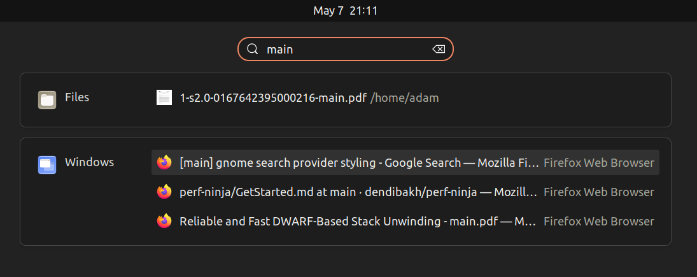

# simple gnome window title search provider




## references

- https://gitlab.gnome.org/GNOME/gnome-weather/-/blob/main/src/service/searchProvider.js
- https://gjs.guide/extensions/development/creating.html#gnome-extensions-tool
- https://github.com/klorenz/gnome-shell-window-search-provider
- https://developer.gnome.org/documentation/tutorials/search-provider.html


## dev

run nested session for debugging:

```
env MUTTER_DEBUG_DUMMY_MODE_SPECS=1024x768 dbus-run-session -- gnome-shell --nested --wayland
```
